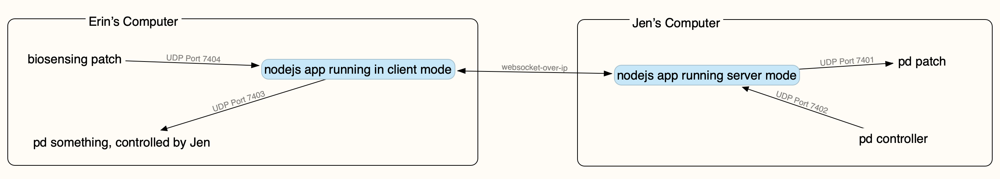

*NOTE: If this is your first time using wspd, see the [releases](https://github.com/michaelpalumbo/wspd/releases) page*

## wspd (websocket 4 puredata)
I recommend trying one of the recent releases of this project, see https://github.com/michaelpalumbo/wspd/releases

**I highly recommend reading this document at https://github.com/michaelpalumbo/wspd/blob/master/README.md or opening [README.pdf](readme.pdf)**

This app acts as a bridge between two computers over the web, enables very fast transmission of controller data between, for example, two puredata patches. 

Since first starting the code, it's become a lot more general than only being used for puredata, but I didn't bother changing the name of the repository!


### Instructions
1. install nodejs
2. clone/download the wspd repository at https://github.com/michaelpalumbo/wspd
3. Open terminal, cd into the folder 'wspd' (the rest of this readme assumes that you're working from this directory) 
4. verify nodejs is installed:

```shell
node -v
```
5.. might need to install dependencies:

```shell
npm install
```
### Test locally
1. start the server

```shell
npm start server
```

2.. open a 2nd terminal window, cd into wspd

3.. start the client

```shell
npm start client localhost
```

4.. open the tester.maxpat (or tester.pd)

Click either of the toggles to confirm data is being sent from pd>nodejs>pd. You should be able to have both toggles clicked, this verifies bi-directionality. 

### Telematic setup

1. whomever can configure their router with DMZ and port-forwarding should run the app in server mode. The diagram below assumes that Jen would be running the server (the code doesn't need to be modified if you choose to have Erin run the server instead)



What to change in your router (server-side only):

- Enable DMZ & advanced DMZ if this is an option
- Set your computer as the DMZ target
- create a port forwarding rule where port 8081 is accessible on your machine and publicly

### OSC Syntax
The nodejs app assumes that all incoming data on UDP follows the OSC format of an Address Pattern followed by Type Tag String. Examples:

- /index 3
- /position 0.3 0.6 0.8
- /msg hello world

If you do not supply an address pattern using the '/', the app will ignore the message. 

#### Other messages
As of right now, the app accepts OSC over UDP, but it would be reasonable to update the script so that it could accept other data from other sources, such from serial ports, MIDI input, etc. 

#### Other remotes/web app
The server can also host a web app, i.e. could be used to host a couple of controls on a web page for anyone to remotely control a patch on either of your machines, etc. The preliminary code is there, just figured I'd mention it if it was of interest at a later time. 
